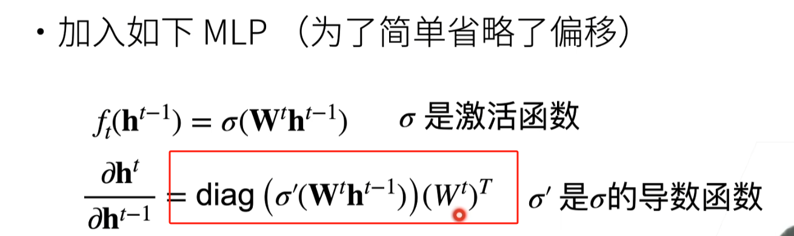

## 2025-2.26

### 随机梯度下降，梯度下降，小批量梯度下降

今天根据李沐的《动手写深度学习》中 MBGD，修改代码，实现BGD发现：

- **学习率的调整** ：对于BGD，损失函数计算的是所有样本的损失，所以loss对w的偏导值会很大，如果沿用MBGD的lr，会发现loss无法收敛，必须降低lr。
- **MBGD的w更新**：对于每一轮epoch，都需要计算一次grad，然后只更新一次，计算grad开销实在太大，而MBGD对小批量的样本计算grad则开销小得多，且每一轮循环可以多次更新w。lr 为 1 算正常，不需要较多轮次便可完成训练
- **矩阵运算 torch.matmul()**：pytorch中的一维数组是以列向量为数学计算约定，而以行向量为表示形式的向量 ,因为此时的size 为 [m] 的tensor 实际上是 列向量

## 2025-2.28

### debug 多线程问题

报错：这有一段很长的报错，请问是为什么：Traceback (most recent call last):
File "<string>", line 1, in <module>
File "G:\Anaconda\envs\you\Lib\multiprocessing\spawn.py", line 122, in spawn_main
exitcode = _main(fd, parent_sentinel)

... 截取最顶端和最低端的报错

File "G:\Anaconda\envs\you\Lib\site-packages\torch\utils\data\dataloader.py", line 1144, in _try_get_data
raise RuntimeError(f'DataLoader worker (pid(s) {pids_str}) exited unexpectedly') from e
RuntimeError: DataLoader worker (pid(s) 30128, 18392, 21084, 11432) exited unexpectedly

这个错误是典型的Windows系统下多进程编程问题，主要由于没有正确使用if __name__ == '__main__'保护主程序入口导致。以下是具体原因和解决方案：

问题原因分析： Windows多进程机制限制

Windows使用spawn方式创建子进程（而非Linux的fork方式），
子进程会重新导入主模块，导致循环执行代码，
需要if __name__ == '__main__'保护主程序入口
DataLoader多进程冲突：
设置了num_workers > 0时会启用多进程加载数据， 主程序中没有正确使用保护机制导致进程冲突

### softmax函数实现时，为什么分母按行求和不按列求和？

样本维度：

1. 在 softmax 中，我们通常是对每个样本的特征进行归一化，而不是对所有样本的同一特征进行归一化。因此，我们需要对每个样本的特征值进行求和，即对每一行进行求和。
2. 如果按列求和，我们会将所有样本的同一特征值相加，这会导致不同样本的特征值相互影响，这不符合 softmax 的设计初衷。

归一化的目标：

1. softmax 的目标是对每个样本的特征进行归一化，使得每个样本的特征值在 0 到 1 之间，并且所有特征值的和为 1。因此，我们需要对每个样本的特征值进行求和，即对每一行进行求和。
2. 如果按列求和，我们会得到所有样本的同一特征值的总和，这并不能帮助我们实现每个样本的特征归一化。

## 2025-3.1~3.3

### 过拟合和欠拟合

- **1.数据集是一堆Tensor该如何处理？**：对于数据集是一堆Tensor，比如通过torch.normal()随机生成，可以选择先 构造 TensorDatasetm对象，再构造 DataLoader对象

```python
from torch.utils.data import DataLoader, TensorDataset
import torch

train_f = torch.normal(0, 1, (1000, 2))
train_labels = torch.where(train_f[:, 0] + train_f[:, 1] > 1, 1, 0)
train_data = TensorDataset(train_f, train_labels)
train_iter = DataLoader(train_data, 10, shuffle=True)
```

- **2.损失函数的传参size问题**：尽量确保 loss 的input size一致，否则可能得出意料之外的结果

```python
import torch
loss = torch.nn.MSELoss()
mat1 = torch.normal(0,1,(100,1))
mat2 = torch.normal(0,1,(1,100))
loss(mat1, mat2)
#UserWarning: Using a target size (torch.Size([1, 100])) that is different to the input size (torch.Size([100, 1])). This will likely lead to incorrect results due to broadcasting. Please ensure they have the same size.
#return F.mse_loss(input, target, reduction=self.reduction)
# Out[6]: tensor(2.1837)
loss(mat1, mat2.T)
#tensor(2.5413)
```

就是这个问题导致我的预测结果 基本保持在一个高度，所以需要明确对于不同size的tensor 调用loss的区别。------------这个任务待定

- **3.通过神经网络拟合数据的流程**：
  1. 构造数据集：可以选择直接构造tensor，也可以选网络上的数据集。

```python
import torch, sys
from torch.utils.data import DataLoader
from torchvision import datasets, transforms

batch_size = 256


def load_data_fashion_mnist(batch_size, resize=None):
    transform = transforms.Compose([transforms.ToTensor()])
    train = datasets.FashionMNIST(root='../data', train=True, download=True, transform=transform)
    test = datasets.FashionMNIST(root='../data', train=False, download=True, transform=transform)
    return (
        DataLoader(train, batch_size, shuffle=True, num_workers=0 if sys.platform == 'win32' else 4,
                   pin_memory=torch.cuda.is_available()),
        DataLoader(test, batch_size, shuffle=False, num_workers=0 if sys.platform == 'win32' else 4,
                   pin_memory=torch.cuda.is_available())
    )
```

2. 定义模型，可以选择自己定义也可以用torch的nn，后者需要继承nn.Module，并且需要重写__init__方法和forward方法

```python
from torch import nn
import torch
class PolynomialModel(nn.Module):
    def __init__(self, degree):
        super(PolynomialModel, self).__init__()
        self.degree = degree
        self.weights = nn.Parameter(torch.randn(degree + 1))

    def forward(self, x):
        y = torch.zeros_like(x)
        for i in range(self.degree + 1):
            y += self.weights[i] * (x ** i)
        return y
```

- **4.矩阵求高次项式**：torch.pow函数
- **5.dataset严重不足时该怎么办**：采用k折交叉验证

### weight_dacay L2正则化

通过weight_decay参数限制参数更新时的权重衰减，从而达到防止过拟合的效果。 （此处不是很理解，代码仍需上手重复实践）

### 为什么说dropout等同于正则化？

## 2025-3.4~3.5

### 为什么合理的模型权重初始化 会让数值更稳定？

如果模型权重一开始就有很极端的值，那么在权重更新时会出现**梯度消失**或者**梯度爆炸**

#### **梯度消失的示例**

假设我们有一个简单的 5 层全连接神经网络，每层只有一个神经元，激活函数为 Sigmoid。

- 权重初始化过小，比如 $( W = 0.01 $)。
- 输入值 $( x = 1 $)。

---

#### **前向传播**

每一层的输出为 $( z = W \cdot a $)，激活值为 $( a = \sigma(z) $)，其中 $( \sigma $) 是 Sigmoid 函数。
Sigmoid 函数的导数为 $( \sigma'(z) = \sigma(z) \cdot (1 - \sigma(z)) $)，最大值仅为 0.25。

- **第 1 层**：
  $( z_1 = 0.01 \cdot 1 = 0.01 )$
  $( a_1 = \sigma(0.01) \approx 0.5025 $)
- **第 2 层**：
  $( z_2 = 0.01 \cdot 0.5025 = 0.005025 $)
  $( a_2 = \sigma(0.005025) \approx 0.50125 $)
- **第 3 层**：
  $( z_3 = 0.01 \cdot 0.50125 = 0.0050125 $)
  $( a_3 = \sigma(0.0050125) \approx 0.50125 $)
- **依此类推**，激活值逐渐接近 0.5。

---

#### **反向传播**

假设损失函数为 $( L $)，反向传播时梯度为：
$[\frac{\partial L}{\partial W_i} = \frac{\partial L}{\partial a_i} \cdot \sigma'(z_i) \cdot a_{i-1}]$

由于 $( \sigma'(z_i) \leq 0.25 $)，且每一层的梯度会乘以 $( \sigma'(z_i) $)，梯度会逐渐衰减：

- **第 1 层梯度**：
  $( \frac{\partial L}{\partial W_1} \approx \frac{\partial L}{\partial a_1} \cdot 0.25 \cdot 1)$
- **第 2 层梯度**：
  $( \frac{\partial L}{\partial W_2} \approx \frac{\partial L}{\partial a_2} \cdot 0.25 \cdot 0.5025 ) $
- **第 3 层梯度**：
  $( \frac{\partial L}{\partial W_3} \approx \frac{\partial L}{\partial a_3} \cdot 0.25 \cdot 0.50125 )$
- **依此类推**，梯度会指数级衰减，最终接近 0，导致权重无法有效更新。

---

如果我们能控制每一层的输入和输出都是0均值同方差，数值就会更稳定，推导如下：（仍在继续编写）

1. 如何控制输入和输出都是0均值同方差？
2. 数值更稳定会减少梯度爆炸和梯度消失带来的影响，对模型权重更新有好处
3. 在深层神经网络中，数值不稳定性会随着层数的增加而累积。如果每一层的输入和输出分布不一致，数值不稳定性会进一步放大，导致训练失败

---

#### 模型权重初始化关于 每一层的input,output都控制在相同的方差，均值为0的随机分布的公式推导

$\sum_j Var(w_j^t) Var({h_j}^{t-1}) = n_{t-1}\gamma_t Var({h_j}^{t-1}$)

3.5解答：首先弄清楚期望和方差的概念：现在一个随机变量，可能取到1,2,3,4,5中的任意一个数，概率一样，那么期望是指定为：$E[X] = \sum_i^5{X_i}P(X_i)$，而方差是指定：$Var[X] = E[(X-E[X])^2]$
根据上述期望公式可得，$E[X] = 5,D[X] = 2$
假设现在有n个随机变量，$X_i$之间独立同分布，那么$E(X_1) = E(X_2) = ... = E(X_n)，$且$D(X_1) = D(X_2) = D(X_n)$

---

### BF16 是什么？ TF16 又是什么？

* **BF16** 和 **TF16** 都是 16 位浮点数格式，主要用于深度学习和高性能计算。

---

### 为什么sigmoid容易引起梯度消失？

Sigmoid 函数的公式为：

$\sigma(x)=\frac1{1+e^{-x}}$其输出范围是(0, 1)，形状为 S 形曲线。
求导：$\sigma\prime(x) = \sigma(x)(1-\sigma(x))$

**Sigmoid 引起梯度消失的原因​**

梯度消失问题是指在反向传播过程中，梯度逐渐变小，最终接近于 0，导致模型参数无法有效更新。Sigmoid 函数容易引起梯度消失的原因如下：

1. ​**梯度值较小**​：
   * Sigmoid 的导数 **σ**′**(**x**)** 的最大值是 0.25，且当输入 **x** 的绝对值较大时，**σ**′**(**x**)** 会趋近于 0。
   * 在反向传播中，梯度是通过链式法则逐层相乘的。如果每一层的梯度都小于 1，多层相乘后梯度会变得非常小。
2. ​**饱和现象**​：
   * 当输入 **x** 的绝对值较大时，Sigmoid 的输出会接近 0 或 1，此时梯度几乎为 0。
   * 这种饱和现象会导致神经元的参数更新非常缓慢，甚至停止更新。

---

### 数据集中有字符串的处理方法：

1. all_features = pd.get_dummies(all_features, dummy_na=True)

`pd.get_dummies(all_features, dummy_na=True)` 这段代码会将 `all_features` 中的分类变量（通常是字符串或类别型数据）转换为虚拟变量（dummy variables），并且会处理缺失值（`dummy_na=True`）。这个过程会导致 `all_features` 的 size 发生变化，原因如下：

### 1. **虚拟变量的生成**

- 对于 `all_features` 中的每一个分类变量（如性别、颜色等），`pd.get_dummies` 会将其转换为多个二进制列（0 或 1），每一列代表该分类变量的一个可能取值。
- 例如，如果有一个分类变量 `color`，其取值为 `['red', 'green', 'blue']`，`pd.get_dummies` 会生成三列：`color_red`、`color_green` 和 `color_blue`。每一列的值表示该行是否属于该类别（1 表示是，0 表示否）。

### 2. **处理缺失值**

- 当 `dummy_na=True` 时，`pd.get_dummies` 会为缺失值（NaN）生成额外的列。例如，如果 `color` 列中有缺失值，`pd.get_dummies` 会生成一列 `color_nan`，表示该行是否缺失。

### 3. **size 的变化**

- 假设原始数据有 `n` 列，其中 `k` 列是分类变量。每个分类变量有 `m_i` 个不同的取值（包括缺失值），那么 `pd.get_dummies` 会将这些分类变量转换为 `sum(m_i)` 列。
- 因此，`all_features` 的列数会增加，导致 size 发生变化。

### 示例

假设 `all_features` 有以下数据：

| color  | size |
|--------|------|
| red    | S    |
| green  | M    |
| blue   | L    |
| NaN    | M    |

执行 `pd.get_dummies(all_features, dummy_na=True)` 后，数据会变为：

| color_red | color_green | color_blue | color_nan | size_L | size_M | size_S |
|-----------|-------------|------------|-----------|--------|--------|--------|
| 1         | 0           | 0          | 0         | 0      | 0      | 1      |
| 0         | 1           | 0          | 0         | 0      | 1      | 0      |
| 0         | 0           | 1          | 0         | 1      | 0      | 0      |
| 0         | 0           | 0          | 1         | 0      | 1      | 0      |

---

## 2025-3.6

### todo：再看一遍模型权重初始化，然后代码实践（Xavier）



这个地方为什么会出现对角矩阵，是怎么推导出来的
推导如下：

假设第t层输入为$h_{t-1}$输出是$h_t$,权重方差是$\gamma_t$,输入的神经元个数为$n_{t-1}$

对于正向传播：当满足$n_{t-1}\gamma_t = 1$时，$Var\begin{bmatrix}h_t\end{bmatrix} = Var\begin{bmatrix}h_{t-1}\end{bmatrix}$
对于反向传播：当满足$n_{t}\gamma_t = 1$时，$Var\begin{bmatrix}\frac{\partial_L}{\partial_h^{t-1}}\end{bmatrix} = n_t \gamma_t Var\begin{bmatrix}\frac{\partial_L}{\partial_h^{t}}\end{bmatrix}$
但是难以同时满足上述条件，所以选取一种折中办法

对于一个已经定义好的神经网络，$n_t,n_{t-1}$都已固定，只能控制$\gamma_t$

1. **Xavier**：
   **使得$\gamma_t(n_{t-1} + n_t) / 2 = 1$即 $\gamma_t = 2 / (n_{t-1}+ n_t)$**
   那么对于正态分布：$N（0,\sqrt{2/(n_{t-1}+n_t)}）$
   对于均匀分布：$(-\sqrt{6/(n_(t-1) + n_t},\sqrt{6/(n_(t-1) + n_t})$
   均匀分布[-a,a]方差为$a^2/3$
   **既然没办法同时满足两个条件，那么如果说能让方差控制在输入个数和输出个数的中间值，那么输出方差就会近似输入方差，差值不会特别大**

---

2. 对于激活函数来说，假设$\sigma(x) = αx + \beta$如果要保证激活前激活后的均值方差不变，那么就得保证$α = 1,\beta = 0$,现在用泰勒展开的话，$sigmoid(x) \approx 1/2 + x/4 -x^3 /48 + O(x^5)$
   
   为了达到上述目标，则需要对激活函数进行调整，改为 $4sigmoid(x) - 2$

---

### **AutoML(自动机器学习)**

看了下大概，好像对DL不是很重要，不看了

---

## 2025-3.7

### MLP和全连接层是什么关系？为什么说卷积层是特殊的全连接层？

---

### 如何从全连接层推导到卷积？

---

## 2025-3.8

### 为什么优先采用小的卷积核而不采用大的卷积核+多层卷积？

计算开销更小

---

### 为什么引入池化层？

举个例子：卷积层对位置十分敏感，比如说一张图片有一条竖线，当拍摄角度发生一点偏差可能竖线就变得稍微倾斜了，对应的卷积核就检测不到这条竖线。

说人话就是，当图片中像素位置发生略微变动时，但整体并未发生变化时，应该依旧能够识别出我们想要的效果，所以采取的策略是**对一个小范围的像素点取出一个特定的值代表该区域，从而允许该值在该小范围内发生变动而最终效果不变**

说鬼话就是：池化操作（如最大池化）能容忍输入特征的微小位移，使网络对物体位置变化更鲁棒。例如，无论猫在图像中的位置如何，池化后的特征仍能保留关键信息体现了**平移不变性**

当然池化的类型有很多种：最大池化，平均池化，自适应池化

---

### 为什么现在池化层用的越来越少？

主要是因为，会做大量的数据增强（即增加噪音，如一张图片里有一个物品左右偏移），这样训练下来的卷积层就不会过拟合到某一个位置，所以淡化了池化层的作用

---

### 交叉熵损失函数的输入

在面对分类问题的时候，一般net的output是一个size为 样本数 x 类别数 的二维矩阵，output[0]样本中的output[0][0]的值代表为该样本 可能是 类别0的概率。
而交叉熵的输入就是这样一堆样本的概率预测向量

---

### 对于LeNet，为什么激活函数从Sigmoid变成ReLU会导致损失一直降不下来

**解决方案**：lr要调小一点

**原因**：

1. **ReLU 的梯度特性**

* ReLU 的梯度在正区间为 1，而在负区间为 0。相比之下，Sigmoid 的梯度是一个平滑的曲线，最大值仅为 0.25。
* 由于 ReLU 的梯度在正区间比 Sigmoid 大得多，权重更新时会更加剧烈。如果学习率设置过高，可能导致权重更新不稳定，甚至引发梯度爆炸问题。

---

## 2025-3.9

### 关于LeNet的超参数调整

1. lr的调整：把激活函数从sigmoid换成relu之后，发现0.08效果比较好，但是并没有较大差异
2. 卷积核的输出通道数：几次尝试中一直出现测试集的accuracy要低于训练集，说明出现了过拟合，但是我**按照线性层的逻辑 去减少卷积核输出的通道数，（相当于减少线性层中W的维度）**，但结果并没有变好。
3. 修改卷积核的size：只能说有略微变化吧，效果也不明显
4. 加入dropout：**这个效果非常明显，直接让测试集的accuracy高出训练集一个level**。但是发现一个比较特殊的点：当我的dropout的p=0.5时，还是有可能出现训练集和测试集accuracy差不多甚至高于的情况，但是当p=0.6时，基本上测试集效果都要高出训练集一截。但相对于前面的数值要略低一些
   综上所述：dropout可以减少过拟合的现象，并且p越高，泛化能力越强，但学习到相应的特征就越难

---

### 为什么AlexNet最后要有两个相同的全连接层Dense(4096)?一个行吗？

待定

---

### 有时对数据做了多种增强，效果反倒比做了少量增强效果差，是为什么？

---

### net对于输入的size是固定的，实际使用时图片不一定是按照要求的size，该怎么处理？

24 卷积神经网络，QA 14：21

