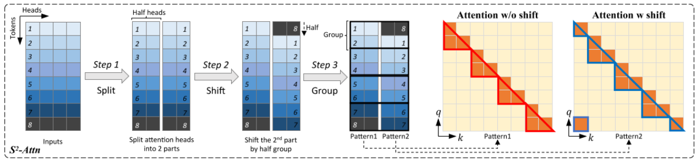
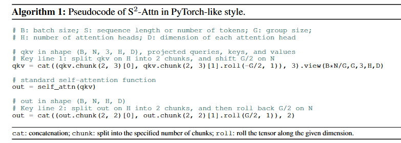
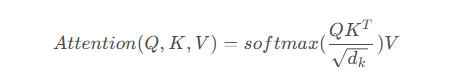

# LongLoRA

## ABSTRCAT

大模型训练成本太贵，提出一种稀疏的局部注意力训练方法LongLoRA，可以高效的对模型进行微调

LongLoRA将改进的LoRA与$S^2-Attention$结合：

1. 用于上下文扩展的LoRA中，在可训练嵌入和标准化的前提下效果很好。(这个地方没太看懂，不知道是什么LoRA)。
2. $S^2-Attention$有效实现了上下文扩展，节省计算量，并且具有与普通注意力微调相似的性能

效果落地：LongLoRA将Llama2从7B/13B 从4k上下文扩展到100k

性能优化：LongLoRA缩小了传统LoRA与fine-tuning之间的精度差距，同时仍保持比fine-tuning低1.8倍的内存成本，通过$S^2-Attention$将LoRA的训练速度提升了1.8倍

## INTRODUCTION

> 大模型通常使用预定义的上下文大小进行训练，比如LLaMA的 2048，Llama2 的 4096

---

LongLoRA概述：在微调期间引入了S²-Attn，训练后的模型**在推理时用的仍然是标准的自注意力**，除了在线性层中训练LoRA权重之外，LongLoRA还进一步**使embedding和Normalization层变得可训练**，并引入了最少数量的附加可训练参数

预定义的上下文大小限制了LLM的应用，比如总结长文档回答长问题，但是就算是对现有的预训练模型进行微调也比较贵

提出问题**我们能否有效的扩展LLM的上下文窗口大小**

一种方法是：采用LoRA（通过低秩矩阵修改自注意力块中的线性投影层），但是研究结果表面，这种方式训练长上下文模型级不够有效也不高效。

1. 对于有效性而言，简单的低秩LoRA会导致长上下文中的**高困惑度**(高困惑度不知道是什么东西)，即使把秩增加到更高的值（256）也并不能缓解此问题
2. 在效率方面，无论是否采用LoRA，随着上下文的扩展，计算成本都会急剧增加（因为自注意力机制的原因）

**用LoRA来近似fine-tuning，短注意力也能够在训练过程中近似长上下文**所以提出S²-Attn来替代标准自注意力机制

具体方法：首先是将上下文长度分为几组，并在每个组内分别进行自注意力计算，在半个注意力头中，平移tokens半个窗口大小，确保相邻组之间的信息流通

比如使用上下文窗口大小为2048的$S^2-Attention$来近似训练8192个上下文长度。与swin-Transformer有点像（paper中说的是this shares a high-level spirit with Swin-Transformer,翻译没看懂）

通过$S^2-Attention$微调的模型在推理过程中保持了原有的注意力架构，有利于大多数现有的优化和基础设施，FlashAttention2在训练和推理时间上都与该方法兼容，原因是短注意力类似于LLMs预训练阶段的注意力方案，其他有效的注意力，比如dilated 或sparse attn和标准风格有很大差距，所以表现不如$S^2-Attention$

经验上表明：可学习的embedding和Normalization是解锁长上下文LoRA微调的关键，二者占用的空间很小（此处图中Normalization有一个$Norm_{Post}和 Norm_{input}$,我不知道什么意思）

---

图3：$S^2-Attention$涉及三个步骤：

1. 先将沿头部维度的特征分为两个块，
2. 其中一个块的tokens被平移半个group大小
3. 将tokens分组，并将其重塑为批量维度
   
 

注意力尽在每个组之间进行计算，而信息通过平移在group之间流动，可能会导致平移可能会导致齐纳在的信息泄露，而通过对注意力掩码进行进行小的改动可以很容易的预防这种情况。在附B.3中的变体2

**SFT对于提高LLM的聊天能力非常重要**

## RELATED WORK

长上下文的Transformer:

1. RAG
2. 将多头注意力改为近似注意力，减轻了自注意力计算的复杂度，比如Longformer和BigBird使用sparse attn处理厂序列
3. 利用记忆机制对过去输入的压缩，来查找相关的tokens

这些压缩与完整的attention有很大的差距，使得预训练的LLM进行微调是不可行的，本文也会用注意力机制的近似，但是和标准注意力差距较小，在$S^2-Attention$上微调，并在推理时保持充分的注意力

---

NTK-aware，Yarn，Position Interpolation，Position Skipping 等方法是通过修改位置嵌入来实现上下文扩展

---

介绍了LoRA的原理，指出为什么LoRA比fine-tuning高效的原因

---

代码：

qkv是一个tensor，qkv.chunk(a,b)的意思是 沿第b维度平均分成a部分,对于上图而言，qkv分割的维度是H，也就是分成两个注意力头部分

roll一个道理，但**为什么roll选择-G/2 而不是G/2**

复杂度怎么计算（全文均指时间复杂度，不考虑空间）：

- 二维矩阵乘法：形状为$M \times N, N \times O$的两个矩阵,复杂度取决于乘法操作的次数，复杂度为$O(MNO)$
- 高维：针对上面的问题，其实不需要计算高维矩阵，因为自注意力机制实际上就是两个二维矩阵做矩阵乘法，即使加上第三维度Batch size，其实也只是多个样本进行累加，即样本的size均为 $[B,N,d_k]$，那么计算加权分数时总复杂度就为 $B \times O(N^2d_k)$

标准的自注意力运算：[【transformer】自注意力源码解读和复杂度计算\_自注意力计算复杂度-CSDN博客](https://blog.csdn.net/qq_23869697/article/details/132646730)

Q,K,V的size均为 $[B,N,d_k]$

1. 将QKV投影到指定维度（多头）：

