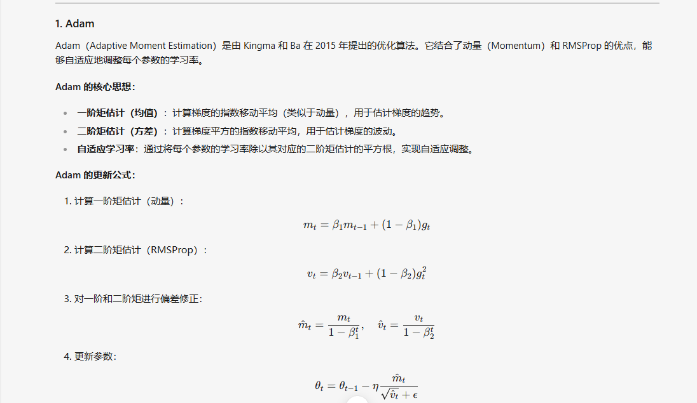
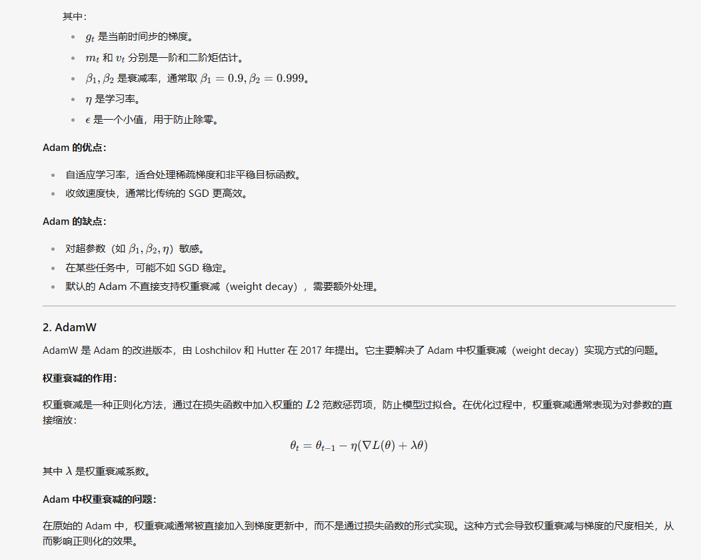
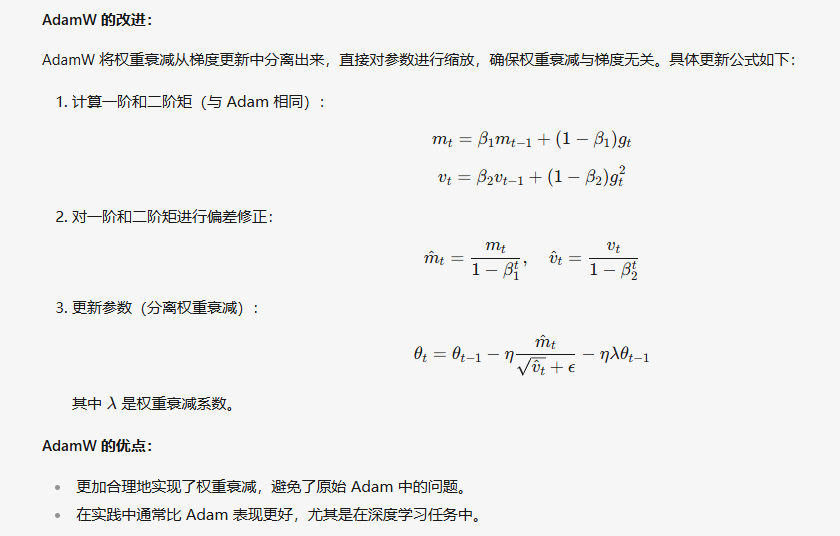

## LongLoRA

把sparse attention 和 LoRA结合起来，使其能更好的处理长文本

## NLP的大语言模型中处理长文本有哪些技术 2

1. 上下文窗口扩展，也就是attention的变种（比如滑动窗口）：就是将整个文本划分为多个窗口，然后计算attention的时候只关注当前窗口，或者选择性关注，
2. 位置外推（Positional Extrapolation）:
   1. Attention with Linear biases(ALiBi):在计算注意力的时候，会对之前位置的分数按照与当前位置的差距进行不同程度的惩罚。从QK矩阵的角度来看，通过直接在注意力分数上施加与距离相关的线性惩罚，该结构会鼓励模型关注更接近pair，并且不完全排除对远处的依赖，加强局限性
   2. xPOS：
3. Positional Interpolation:将位置索引本身进行下采样，或缩放

## 归一化（Normalization）有什么作用？

先说不归一化的话，会有哪些问题：

1. 内部协变量偏移：每一层的输入分布会随着上一层的输出变化而变化，这就导致我的输入变化可能不大，但是经过多层之后，值域区间非常的大，而且分布不稳定，而反向传播依赖于链式求导法则，如果梯度很大或者很小，就会导致梯度消失或者梯度爆炸。
2. 另一个角度来说，如果每一层的输入都保持在一个区间，那么这样模型训练起来就会更快

而归一化就是将数据拉到一个区间，让数据分布的更加稳定，也就解决了上面的问题

## 在NLP中为什么不用BatchNormalization

假设现在有五个句子：句子长度不一样，然后就先用pad到最大长度，Normalization的做法就是将数据拉到一个分布较为稳定的区间，也就是减掉均值，再除以方差，而BN会对一整个batch中的句子的每一个特征做Normalization，但是每一个句子长度不一定一样，这样各个样本之间的差距太大了，效果就不好，所以一般选择LayerNormalization，因为LayerNormalization是对一个样本计算均值和方差，也就是说一个样本里每一个token和特征方差均值都是一样的。

## OOM一般怎么解决

1. 从模型本身的角度来考虑：模型参数量是不是太大了，模型架构设计的时候就会大概算得出来要多少参数，大概多少B的模型对应多少G显存，如果确实模型大，然后显存对不上，那就考虑做量化
2. 从数据的角度考虑：把这个batch size 调小一点，因为train的时候会并行计算一整个batch的数据，同时处理的样本越多，中间计算的梯度，优化器状态，激活值这些就会越多，占用更多的显存
3. 从硬件角度考虑：一般选择的精度是bf32，可以改用混合精度训练，接受一定程度的精度损失，另一方面就是一个GPU不够就用多个嘛，又想要速度单卡显存又不够就做数据并行，只是单纯的装不下模型就做模型并行，多机多卡，单机多卡都行
4. 从推理优化的角度来看：将模型从pytorch的pt或者TensorFlow的h5 转为onnx或者TensorRT，
   1. 在ONNX的优化机制中：有两种方法可以减小显存的占有：
      1. 可以移除一些模型中不必要的操作，比如所冗余的节点，未使用的权重
      2. 算子融合，ONNX Runtime可以将多个小算子融合成一个更大的算子，这样可以减少中间结果的存储和计算开销
   2. TensorRT中也有类似技术：
      1. 层融合：就是把多个连续的操作融合为一个操作，也是一样可以减少中间结果的存储和计算开销
5. 如果硬要对显存压榨到极限的话，可能就得考虑显存碎片了，就是多个被使用的显存片段中间是不连续的，中间有很多块没用到，但是单个区间又用不上

## Deepspeed

**核心思想** GPU不够，CPU来凑
ds将当前时刻，训练模型用不到的参数，缓存到CPU内存里，等要用的时候再从移回来

## 数据并行 模型并行

## 模型的哪些部分比较耗显存

1. 模型权重
2. 激活值
3. 梯度
4. 优化器的状态

## RLHF（reinforcement learning from human feedback）

一种结合强化学习和人类反馈的技术，让llm的生成更符合人类期望的输出

step1：首先得有预训练模型

step2: 然后收集人类反馈（可以是评分，排序，二元反馈，即好坏）

step3: 训练奖励模型

1. 用人类反馈数据来训练一个奖励模型，用于预测人类对模型输出的偏好
2. input是模型的输出，output是标量值，表示符合预期的程度

step4：用奖励模型作为奖励函数，通过强化学习优化llm

关键技术：奖励模型的设计，其质量直接影响最终模型的性能
强化学习算法包括 PPO A2C TRPO

## SFT 监督微调 中哪些因素比较重要

首先是数据集的质量嘛，包括规模啊，准确性，

还有模型类型的选择，有的模型适合情感分类，有的适合文本总结

训练策略：比如说batch size，学习率，但这个看优化算法是什么，要是SGD，那确实受lr影响比较大，但要是Adam，对lr没那么敏感，

1. 数据质量
   1. label对错与否
   2. 数据多样性
   3. 数据规模
2. 预训练模型的选择（不同类型的模型适合不同的任务）
   1. eg
3. 学习率 lr，这个比较看优化算法选的是什么，adam对学习率没那么敏感，但是MSGD就比较敏感
4. 批量大小和训练策略

## 全量微调在什么情况下比LoRA要好

1. 有足够的且高质量的数据：LoRA的主要优势
   待定
2. **任务领域跨度大**

* 当目标任务与预训练模型的原始任务在领域、数据分布等方面有非常大的差异时，全量微调更合适。例如，预训练模型是在通用新闻文本上训练的，而目标任务是医学文献的语义分析。医学领域的术语、语义结构和新闻领域有很大不同，全量微调可以让模型针对医学领域的特点重新调整所有参数，而LoRA由于只对低秩矩阵进行调整，可能无法完全捕捉到这种巨大的差异带来的变化。

## 什么因素会影响显存使用

1. 模型大小
2. 训练的优化算法及训练策略，比如说Adam，会存储额外的状态信息（动量和 二阶矩估计），批量大小的设置

## 如果调大batch size，哪些部分会受影响  2

1. 显存占用增大：批量大小变大意味着每个批次处理的数据变多，那么中间就需要存储更多的梯度，激活值，优化器状态等信息
2. 训练速度可能会变快：GPU有比较好的并行计算能力，在硬件资源充足的情况下，可以加速训练，但对于分布式训练，batch size增大对梯度同步的通信开销也会增大，一定程度上也会影响训练速度
3. 梯度估计会更准确：因为如果一堆数据里有一个错误的样本点那么当这个总数据的n足够大时，取平均会不断减小这个错误的样本点带来的影响
4. 模型泛化能力可能会变差：SGD 的出现的原因，可能会导致泛化能力变差，因为陷入了局部最优

## 在sft中，哪些参数比较重要，有没有比较好的经验值

1. 学习率 lr ：1e-5 到 5e-5
2. 批量大小 batch size 8, 16,32 ...
3. 训练轮数 epochs：一般 3-10个epoch ，如果数据集比较小，可以适当增加
4. 优化器：AdamW SGD, AdamW beta1 = 0.9, beta2 = 0.999

## Sparse Attention 稀疏注意力 2

这个改进的是因为Transformer中的Attention需要对序列中每一个词都进行一次注意力分数计算，假如说他的长度为n，embedding维度为d，那么复杂度为O（n² * d）,但Child在2019年发现，在训练好的Transformer模型里，注意力矩阵基本都是稀疏的，这意味着，其实你大部分的计算是花在了这些贡献不大的token上，所以接下来各种attention的变体都出来了，

比如说我给一个假设，每一个词和它附近的词相关性比较大，那么我设置一个区间，我每次计算注意力的时候，我只计算这个词所处在的区间内的词，这样就节省了很多的计算，

另外一种思路就是，我设置一个全局节点，这个节点会关注整个句子的所有token，意味着这个节点可以捕获整个序列的信息，那么同时，每个节点也会关注这个全局节点，这样相当于是有一个通信中枢，类似于计算机网络中一个局域网里的交换机，既保留了所有节点之间的通信，又让节省了计算

然后有几个技术是专门结合各种sparse attention结构：
Longformer,BigBird,Star-Transformer

## Transformer中有哪些加速收敛和防止过拟合的操作

加速收敛：LayerNormalization，介绍Normalization的作用
防止过拟合：Dropout，数据增强

## 各种Normalization的区别

1. BN：对所有样本的每一个特征进行归一化，有全局的均值和方差，eval时要用
2. LN：对所有样本的每一个句子进行归一化，无全局均值和方差
3. InstanceNormalization：对每一个通道进行归一化
4. GroupNormalization：把几个通道划分成一个组，然后对其进行归一化

## PE有哪些，优劣 2

1. 绝对位置编码：
   1. 简单，无参，在大多数NLP的任务中表现比较好，
   2. 无法建模相对位置，长度限制，只能处理最大长度内的input
2. 相对位置编码：eg. Transformer-XL中的相对位置编码：
   1. 捕捉相对关系，更适合需要建模元素之间的相对位置的任务，比如机翻。长度外推————这个地方不懂，有些任务（文本生成，翻译）性能更优，长文本复杂依赖关系的时候有明显优势
   2. 实现复杂，需要预定最大距离
3. 旋转位置编码：旋转位置编码通过旋转矩阵为序列中的每个位置引入位置信息。
   1. RoPE的优势在于其强大的表达能力，特别是在处理具有对称性或周期性特征的数据时表现优异
   2. 实现复杂,通用性好像还没有研究表明，
   3. RoPE 这类嵌入方法在长文本任务具有天然的外推优势
4. 可学习的位置编码

## 长文本技术与Sparse Attention的结合

Longformer:结合局部注意力和全局注意力
BigBird:基于稀疏注意力机制的一种变体，结合局部注意力随机注意力和全局注意力
Reformer:通过局部敏感哈希LSH实现稀疏注意力，将相似的token分组，从而减少计算量
Sparse Transformer: 通过块稀疏或跨步稀疏，实现注意力机制的稀疏化
Linformer:通过低秩近似将注意力的维度从$n^2$降到了n

## 怎么构造的数据集？

分为不同需求下的数据集，对于无监督，其实一句话就可以，这个直接在很多地方可以爬得到，比如说要做一个商品评价生成的，就去淘宝网页上爬对应数据嘛
对于有监督的，能在各大数据集网站上获取到的就不说吧，我上一份工作中的数据获取是让单片机领域的同事写出思路，然后让llm按照样本二次生成，对于代码而言，常规的数据增强是不太行的，但是可以按照这个逻辑去操作，比如用一部分代码做样本，然后对代码片段的重构，语法等价转换，甚至说是定义一个模版，随机填充变量名，最后再做编译验证正确性

## PEFT

EFT即Parameter - Efficient Fine - Tuning（参数高效微调）。

### 一、概念

* PEFT是一类技术的统称，旨在通过仅更新预训练模型中的一小部分参数来对模型进行微调，而不是像传统的全量微调那样更新模型的所有参数。这种方式在保持预训练模型大部分知识的同时，能够快速适应新的任务或数据，并且在计算资源、存储需求和训练时间方面更加高效。

### 二、常见技术

1. **LoRA（Low - Rank Adaptation）**
   * LoRA是PEFT中的一种代表性技术。它通过在预训练模型的某些层（如Transformer架构中的注意力层）中引入低秩矩阵分解的方式来实现微调。具体来说，它将可训练的参数限制在低秩矩阵中，这些低秩矩阵与预训练模型的原始权重矩阵相乘，从而在不改变原始模型结构的基础上对模型进行微调。这种方法的优点是大大减少了需要更新的参数数量，降低了计算成本和存储需求，同时仍然能够在许多任务上取得较好的效果。
2. **Prefix - Tuning**
   * Prefix - Tuning主要是在输入序列的开头添加可训练的前缀向量。在预训练模型的输入层，针对特定的任务，通过优化这些前缀向量来引导模型适应新的任务。在微调过程中，预训练模型的主体参数保持不变，只有这些前缀向量是可训练的。这样可以在不改变模型内部大量参数的情况下，有效地调整模型以适应新的任务需求，并且在自然语言处理等任务中表现出较好的性能。
3. **P - Tuning**
   * P - Tuning也是一种参数高效的微调方法。它通过在预训练模型的嵌入层或其他合适的位置插入可训练的软提示（soft prompt）来实现微调。这些软提示是与输入数据相关联的可学习向量，通过优化这些软提示，可以引导预训练模型更好地适应新的任务，而不需要对模型的整个参数集进行更新。

## prompt怎么构建的

1. 明确目标：你想要什么结果，完成什么任务
2. 提供上下文：问问题时通常有一个潜意识的假设，llm不一定知道，所以你要明确说出来，比如说你要让llm写出一篇文章，文章的受众群体是谁
3. 简单清晰的指令
4. 提供示例
5. 角色扮演

## 如何筛选出高质量数据集

1. 明确目标：需要什么样的数据，类型，格式
2. 完整性
3. 准确性
4. 多样性

## 大模型为什么会有重复输出或者不能停止的现象？从哪些方面可以解决？

1. 训练的数据有问题：当训练的时候某些文本片段重复出现，这样llm在预测下一个token的时候回倾向重复输出
2. 解码策略有问题：
   1. 贪心搜索：每次都选最高概率的token，容易陷入局部最优，导致重复
   2. 采样策略Sampling:temperature设置的不好，
3. 解决方案：数据清洗，去重。一般选择top-k 或者top-p，temperature多测几个值

## 能够保证大模型两次输出的结果一样吗？为什么？

不能，要想输出变化不大，可控的只有一个temperature参数，但是就算我这个参数设为0，也仍然会有其他的原因导致输出不一致：

1. 假设在预测时，由两个token出现的概率一样，那就看架构是怎么设计的，反正总会有一种方式打破这个平局
2. 上游有变动：随机性可能在模型的贪婪解码之前就存在

## 思维链有什么好处，从模型训练和损失函数等方面说说

1. 更好的泛化能力：思维链通过引导模型生成中间推理步骤，帮助模型学到更复杂的逻辑推理能力，这样可以在未见过的任务上表现出更好的泛化能力
2. 减少过拟合：思维链会鼓励模型关注推理过程，而不是输入和输出之间的直接映射，这样可以减少模型对训练数据的过拟合
3. 复杂任务的表现更优：因为思维链可以分解问题，逐个解决
4. 解释性更好：思维链相当于模型推理的可视化工具，让研究者可以知道模型的决策过程，更方便的知道从哪个地方调优，比如说你问一个问题，它会先从他的认知里找出对应资料，如果说有思维链的话，加入他说的资料有误，你就知道是知识灌注的地方有问题，需要继续补充。

对于损失函数：
思维链引入了中间推理过程，那么损失函数可以对每一步的推理进行监督，而不只是对最终结果进行监督，可以让模型训练更容易到达最优点。

## RAG 检索增强生成 retrieval-augmented Generation

rag是一种框架，将信息检索系统 和 llm 结合，弥补llm知识库信息的滞后性，以及信息不够准确的缺点

先将数据用embedding model 转化为向量，然后存在向量数据库，当用户发起请求时，将用户查询转为向量，然后在数据库检索相关知识（通常是计算相似性），然后返回对应结果，拼接结果和问题，返回给llm

## 怎么计算transformer中的参数量

包括embedding层，词表大小 x 每一个词的向量维度
自注意力层：3个矩阵QKV，3 x d x h x d_k = 3 x d²
MLP：2 x d x d_ff
LN:2 x d

## vllm

一个大语言模型高速推理框架，主要的改进是 PageAttention，引入了注意力缓存机制，然后优化了cuda内核，包括flashAttention和 flashInfra的集成

## 混合精度

## Adam

## YaRN

目的是为了解决：如何让一个训练好的模型能够理解和处理比它训练时见过最长的文本还要长的文本序列

## NTK-aware NTK-by-parts Dynamic NTK

## 位置编码内插后注意力计算会增加，如何缓解

## 数据集构建时各种类型数据的比例是如何确定的

## 怎么看训练是否有效

## 训练过程中如何降低显存使用

## Encoder-Decoder 有什么好处

## 典型的encoder-only如Bert的结构细节

在BERT中，输入的向量是由三种不同的embedding求和而成，分别是：

1. wordpiece embedding：单词本身的向量表示。WordPiece是指将单词划分成一组有限的公共子词单元，能在单词的有效性和字符的灵活性之间取得一个折中的平衡。
2. position embedding：将单词的位置信息编码成特征向量。因为我们的网络结构没有RNN 或者LSTM，因此我们无法得到序列的位置信息，所以需要构建一个position embedding。构建position embedding有两种方法：BERT是初始化一个position embedding，然后通过训练将其学出来；而Transformer是通过制定规则来构建一个position embedding
3. segment embedding：用于区分两个句子的向量表示。这个在问答等非对称句子中是用区别的。
   BERT模型的输入就是wordpiece token embedding + segment embedding + position embedding

然后堆叠多个Attention，用GELU替换掉原本的ReLU

## 多层堆叠时如何避免梯度消失和梯度爆炸

## encoder-only和decoder-only的对比，纯理解场景哪个更优

前者，这种架构的优点是能够更好地理解输入文本的语义和上下文信息，从而提高[文本分类](https://so.csdn.net/so/search?q=%E6%96%87%E6%9C%AC%E5%88%86%E7%B1%BB&spm=1001.2101.3001.7020)和情感分析等任务的准确性。缺点是它无法直接生成文本输出，因此在需要生成文本的任务中不太适用

## 如何判断一个模型是否收敛，从多个角度回答

1. 看损失值
2. 看参数的梯度值
3. 看训练集和验证集的指标
